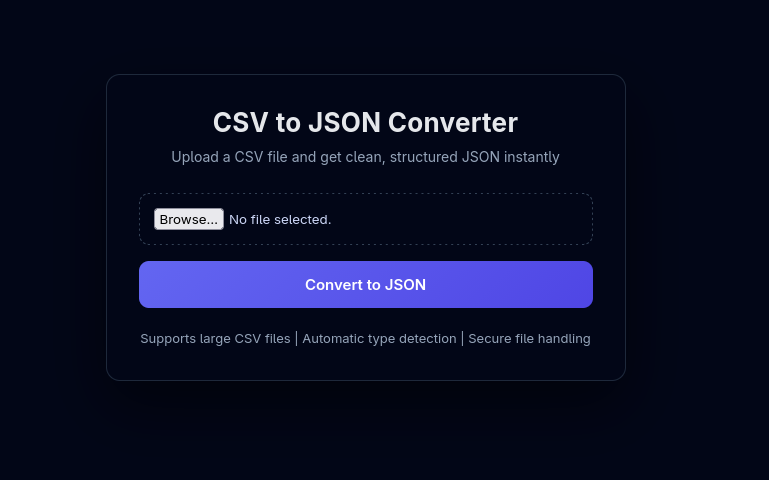

<p align="center">
  
</p>

# CSV to JSON Converter

**CSV to JSON Converter** is a utility built to convert CSV files into JSON.  
I did this  project for learning backend fundamentals like file uploads, streaming data processing, and safe server-side file handling.

Live Demo : **https://to-json.vitthalhumbe.me**

---

## Features

- Convert CSV files to JSON instantly
- Streaming-based parsing (handles large files efficiently)
- Automatic data type inference (number, boolean, null, string)
- Handles BOM and real-world CSV edge cases
- Secure file upload and cleanup after processing
- Clean, minimal UI

---

## Tech Stack

| Domain | Tools |
|------|------|
| Frontend | HTML, CSS |
| Backend | Node.js, Express |
| File Handling | Multer, csv-parser |
| Deployment | Render |
| Domain | Namecheap (Custom Subdomain) |

---

## Run Locally

```bash
git clone https://github.com/vitthalhumbe/file_converter.git
cd file_converter
npm install
npm run dev
